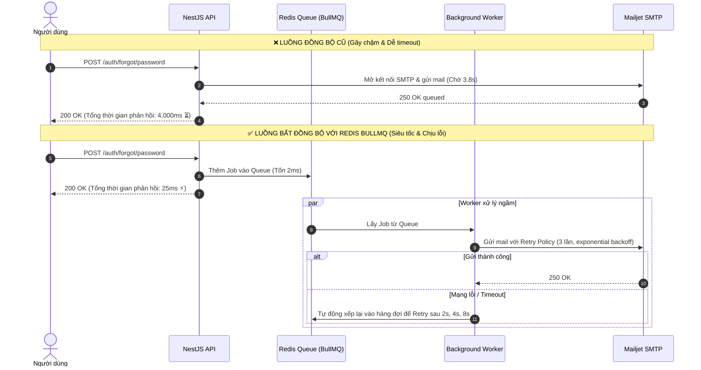
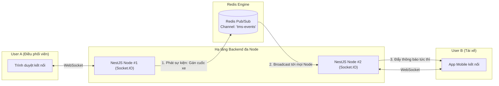

# Kiến Trúc & Vai Trò Của Redis Trong Hệ Thống Spider TMS

---

## 1. Tổng quan (Executive Summary)

Trong hệ thống **Spider Express Logistics TMS (Transportation Management System)**, cơ sở dữ liệu chính (PostgreSQL / Neon) đảm nhiệm việc lưu trữ dữ liệu bền vững (Persistence Data). Tuy nhiên, đối với các hệ thống Logistics đòi hỏi xử lý thời gian thực, lưu lượng điều phối xe cao và tính chịu lỗi khắt khe, **Redis** đóng vai trò là **Lớp Hạ Tầng Tốc Độ Cao (In-Memory Middleware Engine)** với 4 trụ cột cốt lõi:

1. **Hàng đợi tác vụ bất đồng bộ (Async Job Queue via BullMQ)**: Xử lý email, SMS, push notification, tính toán lộ trình không làm block HTTP request.
2. **Mở rộng WebSocket đa cụm (WebSocket Scale-out & Pub/Sub)**: Đồng bộ Socket.IO Gateway khi hệ thống chạy nhiều Pod/Instance trên Cloud.
3. **Bộ giới hạn tần suất phân tán (Distributed Rate Limiting)**: Lưu trữ bộ đếm `@nestjs/throttler` chống brute-force và DDoS trên cụm phân tán.
4. **Bộ nhớ đệm hiệu năng cao (High-Performance Caching)**: Giảm tải truy vấn cho PostgreSQL đối với KPI, Dashboard thống kê, danh mục Hub & Fleet.

---

## 2. Sơ đồ Kiến trúc Tổng thể (Overall Architecture Diagram)

```mermaid
graph TB
    subgraph ClientLayer["Clients & Endpoints"]
        WebAdmin["Web App (Next.js 15)"]
        DriverApp["Driver Mobile / PWA"]
        Attacker["Bot / Flooder"]
    end

    subgraph APILayer["NestJS API Gateway Cluster"]
        API1["NestJS Node #1"]
        API2["NestJS Node #2"]
        ThrottlerGuard["Throttler Guard"]
    end

    subgraph RedisCluster["REDIS ENGINE (In-Memory)"]
        QueueBullMQ[("BullMQ Queues<br/>• mail-queue<br/>• notification-queue<br/>• order-processing")]
        PubSubAdapter[("Socket.IO Redis Pub/Sub<br/>• driver-location<br/>• order-status-events")]
        RateLimitStore[("Distributed Rate Limit Store<br/>• IP & User Counters")]
        CacheStore[("App Cache Layer<br/>• Hub stats / Active vehicles")]
    end

    subgraph WorkerLayer["BullMQ Background Workers"]
        MailWorker["Mail & Notification Worker"]
        CronWorker["Scheduled Task Worker"]
    end

    subgraph ExtServices["External Third-Party APIs"]
        Mailjet["Mailjet SMTP / Relay"]
        CloudStorage["Supabase S3 Storage"]
    end

    subgraph DatabaseLayer["Primary Database"]
        Postgres[("Neon PostgreSQL<br/>(Transactional DB)")]
    end

    %% Client to API
    WebAdmin -->|HTTPS / WSS| API1
    DriverApp -->|HTTPS / WSS| API2
    Attacker -->|Spam Requests| ThrottlerGuard

    %% API to Redis
    ThrottlerGuard -->|Check Limit (0.5ms)| RateLimitStore
    API1 -->|Add Job| QueueBullMQ
    API2 -->|Add Job| QueueBullMQ
    API1 <-->|Sync WebSocket Events| PubSubAdapter
    API2 <-->|Sync WebSocket Events| PubSubAdapter
    API1 -->|Cache Get/Set| CacheStore

    %% Workers
    QueueBullMQ -->|Consume Jobs| MailWorker
    QueueBullMQ -->|Trigger Cron| CronWorker
    MailWorker -->|Dispatch Email| Mailjet
    MailWorker -->|Update Status| Postgres

    %% Database queries
    API1 -->|Business CRUD| Postgres
    API2 -->|Business CRUD| Postgres
```

---

## 3. Bốn Vai Trò Trọng Yếu Của Redis Trong Hệ Thống

### 📌 Trụ cột 1: Xử lý Bất đồng bộ với BullMQ (Async Background Queue)

Trong vận hành Logistics, việc gửi email kích hoạt, email quên mật khẩu hay gửi thông báo đẩy đơn hàng đến tài xế mất từ **2.5 đến 5 giây** (do độ trễ mạng Internet và SMTP TLS handshake). Nếu xử lý đồng bộ, người dùng sẽ bị đơ giao diện và Server nhanh chóng cạn kiệt Connection Pool.

#### 🔄 So sánh Luồng Đồng bộ (Cũ) vs Luồng Redis Queue (Mới):



#### Các lợi ích vượt trội:
- **Phản hồi 0ms độ trễ (Instant Response)**: Giao diện người dùng nhận kết quả thành công ngay lập tức.
- **Tự động Thử lại (Auto-Retry & Exponential Backoff)**: Nếu Mailjet hoặc mạng lỗi chập chờn, job sẽ tự động retry mà không làm mất thông báo của người dùng.
- **Bảo vệ Hệ thống khỏi Quá tải (Traffic Spike Smoothing)**: Khi có 1,000 đơn hàng tạo đồng thời lúc 12:00 trưa, hàng đợi Redis sẽ điều tiết tốc độ gửi mail ở mức an toàn (ví dụ: 50 emails/giây) tránh bị nhà mạng khóa tài khoản vì spam.

---

### 📌 Trụ cột 2: Đồng bộ WebSocket Đa Cụm (Socket.IO Redis Pub/Sub Adapter)

Khi hệ thống mở rộng quy mô (Scale-out) chạy trên nhiều Node/Pod (Render, Kubernetes):



- **Vấn đề**: Người điều phối kết nối tới `Node #1`, tài xế kết nối tới `Node #2`. `Node #1` không thể trực tiếp gửi WebSocket sang client trên `Node #2`.
- **Giải pháp Redis Adapter**: `Node #1` đẩy message vào kênh Redis Pub/Sub $\rightarrow$ Redis broadcast tức thì sang `Node #2` $\rightarrow$ `Node #2` bắn sự kiện xuống app của tài xế trong **< 5ms**.

---

### 📌 Trụ cột 3: Giới hạn Tần suất Phân tán (Distributed Rate Limiting)

Hiện tại `@nestjs/throttler` lưu bộ đếm IP trong RAM của server. Khi server restart hoặc chạy nhiều node, bộ đếm bị reset.

- **Khi dùng Redis Storage**: Toàn bộ số lần request của mỗi IP/User được lưu tập trung trên Redis với TTL chính xác từng millisecond:
  - `POST /auth/forgot/password`: Tối đa 5 requests / 60s.
  - `POST /auth/email/login`: Tối đa 10 requests / 60s.
- Bất kể người dùng gửi request vào Node nào trong cụm, Redis đều tính toán và chặn đứng IP tấn công ngay tại Node đó.

---

### 📌 Trụ cột 4: Caching Tối ưu Truy vấn Cơ sở dữ liệu

- **Hubs & Vehicle Specs**: Danh mục kho bãi, loại phương tiện hiếm khi thay đổi $\rightarrow$ Cache Redis trong **10 phút**.
- **Dashboard Summary KPIs**: Số lượng đơn hàng mới, chuyến xe đang chạy $\rightarrow$ Cache Redis trong **30 giây**. Giảm **70-80% số lượng truy vấn đè nặng lên PostgreSQL (Neon DB)**.

---

## 4. Runbook Thiết Lập Nhanh BullMQ + Redis trên NestJS

### 1. Cài đặt thư viện:
```bash
npm install @nestjs/bullmq bullmq ioredis
```

### 2. Cấu hình Module (`app.module.ts`):
```typescript
import { BullModule } from '@nestjs/bullmq';

@Module({
  imports: [
    BullModule.forRootAsync({
      imports: [ConfigModule],
      useFactory: (configService: ConfigService) => ({
        connection: {
          url: configService.getOrThrow('REDIS_URL'),
          maxRetriesPerRequest: null,
          enableReadyCheck: false,
        },
      }),
      inject: [ConfigService],
    }),
    BullModule.registerQueue(
      { name: 'mail' },
      { name: 'notifications' },
    ),
  ],
})
export class AppModule {}
```

### 3. Đẩy Job vào Queue (`Producer`):
```typescript
@Injectable()
export class AuthService {
  constructor(
    @InjectQueue('mail') private readonly mailQueue: Queue,
  ) {}

  async forgotPassword(email: string): Promise<void> {
    // Đẩy vào hàng đợi và return ngay lập tức
    await this.mailQueue.add(
      'send-reset-password',
      { email, hash, tokenExpires },
      {
        attempts: 3,
        backoff: { type: 'exponential', delay: 2000 },
        removeOnComplete: 100,
        removeOnFail: 50,
      },
    );
  }
}
```

### 4. Xử lý Job ở Background (`Consumer / Processor`):
```typescript
@Processor('mail')
export class MailProcessor extends WorkerHost {
  private readonly logger = new Logger(MailProcessor.name);

  constructor(private readonly mailerService: MailerService) {
    super();
  }

  async process(job: Job<{ email: string; hash: string; tokenExpires: number }>): Promise<void> {
    this.logger.log(`Processing background mail job ${job.id} for ${job.data.email}`);
    await this.mailerService.sendMail({
      to: job.data.email,
      subject: '[Spider Express TMS] Khôi phục mật khẩu',
      templatePath: 'reset-password.hbs',
      context: { ...job.data },
    });
  }
}
```

---

## 5. Tổng kết So Sánh

| Thành phần | Không có Redis (Hiện tại) | Có Redis (Chuẩn Enterprise) |
| :--- | :--- | :--- |
| **Thời gian phản hồi Quên mật khẩu / Gửi mail** | 2.5s - 4s (Chờ SMTP) | **< 30ms** (Giao diện cực mượt) |
| **Tính chịu lỗi khi Mailjet mất mạng** | Gặp lỗi 500, mất request | **Tự động Retry 3 lần sau 2s, 4s, 8s** |
| **Khả năng mở rộng Đa Server (Cluster)** | WebSocket bị đứt liên kết giữa các node | **Đồng bộ thời gian thực 100% qua Redis Pub/Sub** |
| **Chống Spam / DDoS Brute-Force** | Từng node đếm riêng, reset khi khởi động | **Quản lý Rate Limit tập trung toàn hệ thống** |
| **Tải chịu đựng của PostgreSQL** | Phải gánh 100% lượt đọc Dashboard liên tục | **Giảm 70-80% áp lực truy vấn nhờ Caching** |
